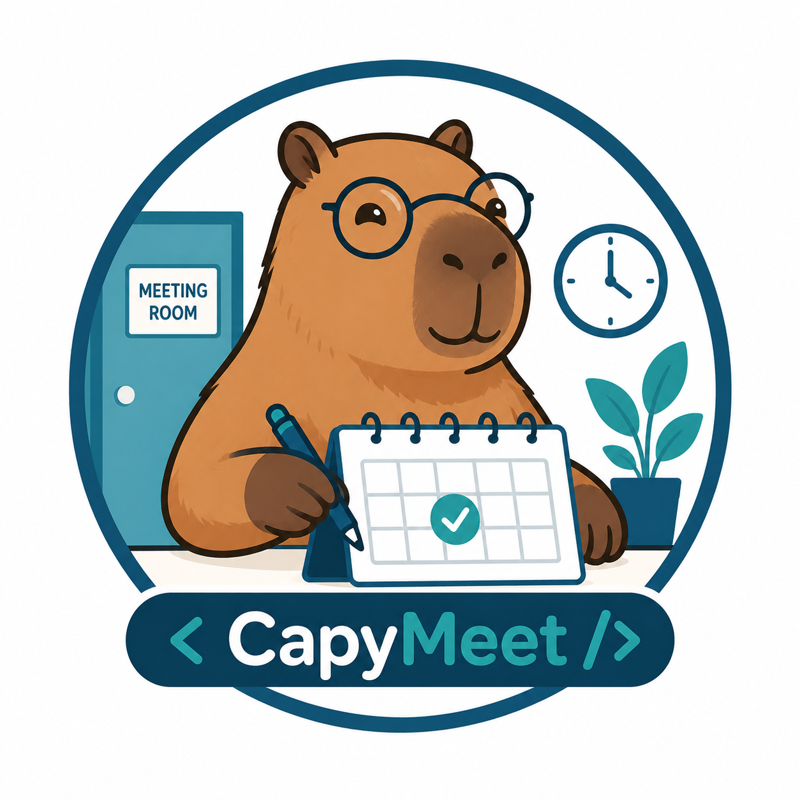
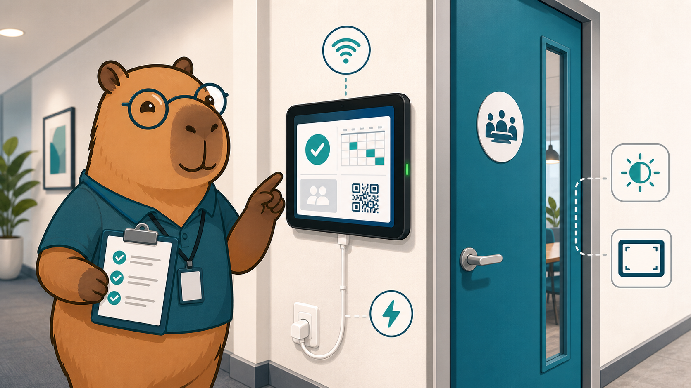

# CapyMeet

<p align="center">
  <a href="README.md">简体中文</a> | <a href="README.en.md">English</a>
</p>

<p align="center">
  
</p>

<p align="center">
  <strong>面向企业会议室场景的预约、门牌与后台管理系统</strong>
</p>

## 项目简介

CapyMeet 是一套会议室预约管理系统，覆盖员工预约、会议室门口 Pad 展示、管理员后台维护和可选邮件通知。它适合公司内部会议室、共享空间、培训室、展厅会议区等需要集中管理预约和现场状态展示的场景。

系统由三个面向用户的入口组成：

| 入口 | 典型使用者 | 主要用途 |
| --- | --- | --- |
| 公共预约页 `/`、`/book/:token` | 员工、访客、内部活动参与者 | 查看会议室、选择时间、提交预约 |
| 门口 Pad `/pad/:deviceCode` | 会议室门口平板 | 展示房间状态、今日日程和扫码预约二维码 |
| 管理后台 `/admin` | 行政、前台、IT 或空间管理员 | 管理房间、设备、预约、审批、二维码和账号 |


_CapyMeet 以卡皮巴拉作为统一视觉主题，把手机预约、门口 Pad 和后台管理连接成一条清晰的会议室运营链路。_

## 功能结构

### 1. 公共预约端

公共预约端用于让用户快速完成会议室预约。

- 支持从首页直接预约，也支持通过管理员生成的预约链接进入。
- 支持全局预约链接和房间专属预约链接。
- 用户可查看会议室基本信息、开放日期、开放时间、预约时长限制和已有预约。
- 提交预约时需要填写会议主题、联系人姓名、邮箱、日期、开始时间和结束时间。
- 预约前会提示明显的时间冲突和缓冲时间冲突。
- 房间可配置为自动确认，也可配置为需要管理员审批。
- 预约成功后，根据房间规则进入“已确认”或“待审批”状态。


_公共预约端适合放在公司内网页、二维码海报或会议室门口扫码入口中；用户只需要按步骤选择房间和时间，就能提交预约。_

### 2. 门口 Pad 端

门口 Pad 用于会议室外屏幕展示，核心目标是让路过的人一眼看懂房间状态。

- 每台 Pad 使用独立设备码访问，例如 `/pad/boardroom-pad`。
- Pad 可绑定默认会议室，打开后自动显示该房间。
- 支持临时切换查看其他会议室，空闲一段时间后回到默认会议室。
- 显示当前房间是否可用、当前会议、主持人、时间段和当天后续日程。
- 只展示已确认会议，待审批会议不会出现在门口日程中。
- 显示当前房间的扫码预约二维码，扫码后直接进入该房间预约页。
- 每 10 秒自动刷新时间、同步日程，并向后台上报设备心跳。



_Pad 端强调现场可靠性：固定房间、固定页面、稳定网络和持续供电，配合长亮/全屏设置后即可作为会议室门牌长期运行。_

### 3. 管理后台

管理后台是系统配置和日常运营中心。

| 模块 | 功能 |
| --- | --- |
| Dashboard | 查看所有会议室当前状态、今日预约、待审批数量和后续会议 |
| Rooms | 创建、编辑、启用/禁用会议室，配置容量、位置、设备说明、开放时间、缓冲时间、最短/最长预约时长、提前预约天数和审批规则 |
| Devices | 创建和维护 Pad 设备，配置设备码、设备名称、默认会议室和启用状态 |
| Bookings | 查看预约列表，按房间筛选和排序，管理员可手动创建、取消或删除预约 |
| Approvals | 审核待审批预约，支持通过和拒绝；通过时会再次检查时间冲突 |
| Links & QR | 创建全局预约链接、房间专属预约链接，查看二维码，启用/禁用或删除旧链接 |
| Email | 开关邮件通知，配置邮件主题、回复说明，并发送测试邮件 |
| Admins | 创建管理员账号，启用/禁用账号，修改姓名或重置密码 |


_管理后台把会议室配置、设备绑定、预约处理和二维码发放集中在一起，方便行政或 IT 做日常维护。_

### 4. 通知和审计

- 邮件通知是可选功能，配置发件邮箱和 Resend API Key 后启用。
- 已确认预约、审批通过、审批拒绝等场景可以触发邮件。
- 邮件发送失败不会阻断预约或审批流程。
- 删除房间、操作预约、管理链接、修改邮件设置等关键后台动作会记录审计数据，便于后续追踪。

## 核心业务对象

| 对象 | 说明 |
| --- | --- |
| 会议室 | 可预约空间，包含位置、容量、设备说明、开放时间和预约规则 |
| Pad 设备 | 门口屏设备，使用设备码访问，可绑定默认会议室 |
| 预约 | 一次会议室占用记录，包含主题、联系人、邮箱、时间、来源和状态 |
| 预约链接 | 管理员生成的公开入口，可以面向所有房间，也可以限定到单个房间 |
| 管理员 | 可登录后台的账号，支持启用、禁用和密码重置 |
| 邮件设置 | 控制通知开关、邮件主题和回复说明 |

## 典型使用流程

### 管理员初始化

1. 部署系统并完成数据库迁移。
2. 创建第一个管理员账号。
3. 登录 `/admin/login`。
4. 在 Rooms 中创建会议室并配置预约规则。
5. 在 Devices 中创建 Pad 设备并绑定默认会议室。
6. 在 Links & QR 中创建预约链接和二维码。
7. 如需邮件通知，在 Email 中配置并发送测试邮件。

### 用户预约会议室

1. 用户打开公共预约页或扫码进入房间专属预约页。
2. 选择会议室、日期和时间。
3. 查看当天已有预约和预约规则提示。
4. 填写会议主题、联系人姓名和邮箱。
5. 提交预约。
6. 系统返回已确认或待审批结果。

### 管理员处理预约

1. 在 Dashboard 查看各会议室状态。
2. 在 Bookings 查看、筛选、取消或删除预约。
3. 在 Approvals 处理需要审批的预约。
4. 如果审批通过后发生时间竞争，系统会提示冲突，避免重复占用。

## Pad 部署与长亮设置

门口 Pad 建议按“固定设备、固定房间、固定电源、固定页面”的方式部署。

### Pad 设备准备

- 在后台 Devices 中为每台 Pad 创建一个设备，例如 `boardroom-pad`。
- 给设备绑定默认会议室。
- 在 Pad 浏览器中打开 `/pad/<deviceCode>`。
- 确认页面能显示房间名称、今日预约和二维码。
- 将 Pad 固定在会议室门口，并保持稳定 Wi-Fi。
- 建议使用持续供电，不依赖电池运行整天。

### iPad 长亮建议

不同 iPadOS 版本菜单名称可能略有差异，常见设置如下：

- 打开系统设置，进入“显示与亮度”，将“自动锁定”设置为“永不”。
- 如果设备受公司 MDM 管理，请确认 MDM 没有强制较短的自动锁屏时间。
- 使用 Safari 打开 Pad 地址后，可以“添加到主屏幕”，再从主屏幕启动，减少浏览器地址栏干扰。
- 开启“引导式访问”可以限制用户退出 Pad 页面；通常在“辅助功能”中开启，使用时连续按三下侧边按钮或主屏幕按钮。
- 长时间亮屏建议降低亮度，避免屏幕老化和过热。
- 如果会议室门口光线变化明显，可以关闭自动亮度，手动设定一个稳定亮度。

### Android 平板长亮建议

不同品牌路径不同，常见设置如下：

- 在“显示”或“锁屏”设置中，将“屏幕超时”“休眠”设置为“永不”或系统允许的最长时间。
- 如果系统没有“永不”，可开启开发者选项中的“充电时保持唤醒”。
- 使用 Chrome 打开 Pad 地址后，可添加到主屏幕，或使用设备自带的 kiosk / 单应用模式。
- 企业设备建议使用 MDM、Android Enterprise 或厂商 kiosk 工具锁定到 Pad 页面。
- 保持充电器长期连接时，优先使用质量可靠的电源和线材，并定期检查电池鼓包、发热和线缆松动。

### 浏览器和现场提示

- Pad 页面依赖网络访问后台，建议会议区 Wi-Fi 覆盖稳定。
- 如果页面长时间未更新，先检查网络、电源、设备是否自动锁屏，以及后台 Devices 中设备是否仍启用。
- Pad 页面每 10 秒同步一次状态；刚创建或修改预约后，门口屏可能需要等待下一次刷新。
- 二维码指向当前房间预约页，换绑默认会议室后建议刷新 Pad 页面确认二维码已更新。
- 会议室门口适合开启全屏、隐藏系统通知、关闭无关弹窗和系统自动更新提醒。
- 建议每周巡检一次 Pad：确认屏幕常亮、时间正确、二维码可扫、房间绑定正确、设备无过热。

## 预约规则

创建预约时系统会检查以下规则：

- 会议室必须存在且处于启用状态。
- 结束时间必须晚于开始时间。
- 预约日期和时间必须落在会议室开放范围内。
- 预约不能超过会议室配置的最大提前预约天数。
- 预约时长不能短于最短时长，也不能超过最长时长。
- 已确认和待审批预约都会占用时间段。
- 会议室缓冲时间会纳入冲突检测，例如需要会前/会后清场时可设置缓冲。
- 公共预约遵循会议室审批规则；管理员手动创建的预约会直接确认。
- 审批通过时会再次检查冲突，避免多个待审批预约占用同一时间。

主要状态流转：

```text
待审批 -> 审批通过 -> 已确认
待审批 -> 审批拒绝 -> 已拒绝
已确认 / 待审批 -> 管理员取消 -> 已取消
```

当前自助取消入口已经移除。用户如需修改或取消预约，需要联系管理员在后台处理。

## 部署和运营提示

### 必需配置

| 配置 | 说明 |
| --- | --- |
| D1 数据库 | 存储会议室、设备、预约、管理员、预约链接和邮件设置 |
| `JWT_SECRET` | 管理后台登录令牌密钥，建议使用至少 32 个字符的随机字符串 |
| `PUBLIC_BASE_URL` | 线上访问地址，用于生成预约链接和二维码 |

### 可选配置

| 配置 | 说明 |
| --- | --- |
| `RESEND_API_KEY` 或 `EMAIL_API_KEY` | 邮件服务 API Key |
| `EMAIL_FROM` | 邮件发件人 |

### 日常运营建议

- 房间启用前先检查开放日期、开放时间、最短/最长预约时长和缓冲时间。
- 需要人工把关的会议室可开启审批规则。
- 不再使用的预约链接建议禁用或删除。
- Pad 设备换房间后，应同步修改默认会议室并刷新门口 Pad。
- 管理员离职或职责变更后，应及时禁用账号。
- 邮件通知启用后，应定期发送测试邮件确认服务可用。

<details>
<summary>开发者附录：技术、命令和接口概览</summary>

## 技术概览

| 层级 | 技术 |
| --- | --- |
| 前端 | React、TypeScript、Vite |
| 后端 | Hono、Cloudflare Pages Functions |
| 数据库 | Cloudflare D1 |
| 认证 | JWT、bcryptjs |
| 校验 | Zod、@hono/zod-validator |
| 邮件 | Resend API |
| 测试 | Vitest、Testing Library、jsdom |

## 常用命令

```bash
npm install
npm run dev
npm run build
npm run dev:worker
npm test
cp wrangler.example.toml wrangler.toml
npm run db:migrate:local
npm run db:migrate:remote
npm run deploy
```

## 第一个管理员账号

系统没有匿名创建管理员的入口，首次部署后需要手动写入一个管理员账号。

生成密码哈希：

```bash
node --input-type=module -e "import bcrypt from 'bcryptjs'; console.log(await bcrypt.hash(process.argv[1], 12));" "<temporary-admin-password>"
```

写入 D1 示例：

```bash
npx wrangler d1 execute capymeet --remote --command "
INSERT INTO admins (id, email, name, password_hash, is_enabled, created_at, updated_at)
VALUES (
  'admin-1',
  'admin@your-domain.example',
  'Admin',
  '<paste-bcrypt-hash-here>',
  1,
  datetime('now'),
  datetime('now')
);
"
```

## 主要前端路径

| 路径 | 页面 |
| --- | --- |
| `/` | 公共预约页 |
| `/book/:token` | 预约链接入口 |
| `/pad/:deviceCode` | Pad 门牌页 |
| `/cancel` | 取消功能不可用提示页 |
| `/admin/login` | 管理员登录 |
| `/admin` | 管理仪表盘 |
| `/admin/rooms` | 会议室管理 |
| `/admin/devices` | Pad 设备管理 |
| `/admin/bookings` | 预约管理 |
| `/admin/approvals` | 审批管理 |
| `/admin/links` | 预约链接和二维码 |
| `/admin/email-settings` | 邮件设置 |
| `/admin/admins` | 管理员账号 |

## 主要 API 分组

| 分组 | 用途 |
| --- | --- |
| `/api/public/*` | 公共房间、公开日程、预约链接和公共预约创建 |
| `/api/tablet/*` | Pad 设备信息和心跳 |
| `/api/admin/*` | 登录后的后台管理接口 |

## 测试

```bash
npm test
```

测试覆盖时间工具、预约规则、数据库访问、API 入口、页面组件和数据库迁移。

</details>

## 相关文档

- [Cloudflare 部署指南（中文）](docs/cloudflare-deployment-zh.md)
- [用户使用手册（中文）](docs/user-manual-zh.md)

## 技术支持

如需技术支持，请联系：frostrs@163.com

## 许可证

Copyright 2026 CapyMeet Team.

本项目基于 Apache License 2.0 开源，详见 [LICENSE](LICENSE)。
